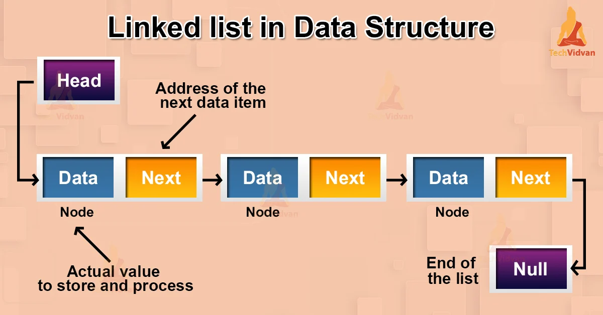

# Javascript Linked List Questions and Answers 👨‍💻

This repository is dedicated to providing answers to frequently asked questions related to the Linked List data structure in JavaScript 🚀. The repository covers different types of linked lists, basic operations such as insertion, deletion, and search, and standard problems related to linked lists 💡.

_Photo credit: [Tech Vidvan](https://techvidvan.com/tutorials/linked-list-in-data-structure/)_

## What is a Linked List?

A Linked List is a linear data structure that consists of nodes, each node containing a data field and a reference to the next node. Linked lists offer several advantages over arrays, such as dynamic size, efficient insertion and deletion, and ease of use 💪.

## Types of Linked Lists

The repository covers different types of linked lists, including singly linked lists, doubly linked lists, circular linked lists, and circular doubly linked lists 🔄.

## Basic Operations

The repository covers the basic operations of linked lists, such as insertion, deletion, search, and traversal. You will learn how to insert and delete nodes in different types of linked lists, search for elements, reverse linked lists, and find the length of linked lists 📈.

## Standard Problems

The repository covers standard problems related to linked lists, ranging from easy to hard. You will learn how to find the middle element of a linked list, count the number of times a given integer occurs in a linked list, detect loops, merge and sort linked lists, and much more 🧐.

The repository also covers advanced topics, such as the Great Tree-List Recursion Problem and Priority Queue using doubly linked lists 🔍.

## How to use this repository

This repository is organized by types of linked lists and standard problems. You can navigate through the questions and their respective answers by checking the . The repository is designed to provide practical examples and explanations that are easy to follow, making it suitable for both beginners and experienced developers 🎓.
